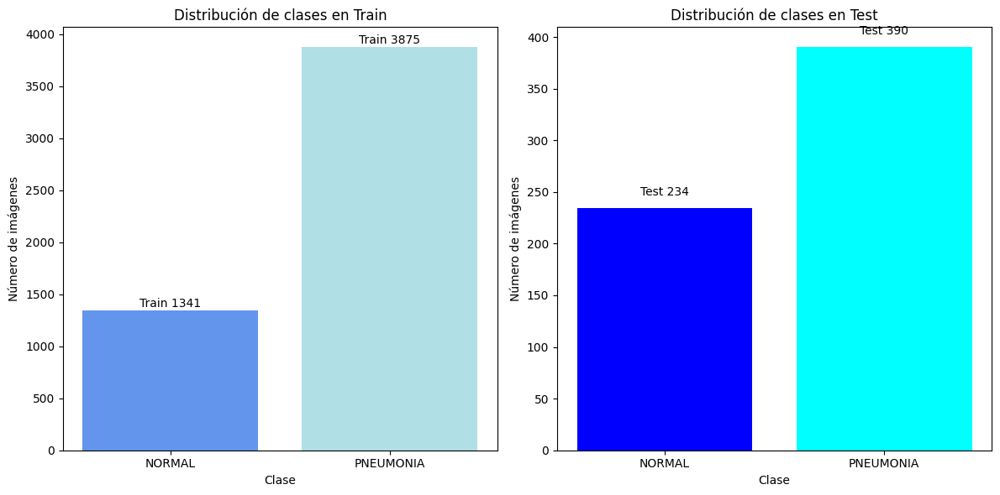
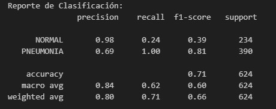
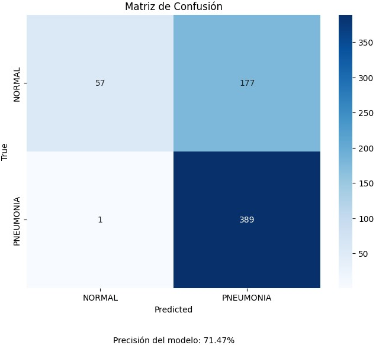
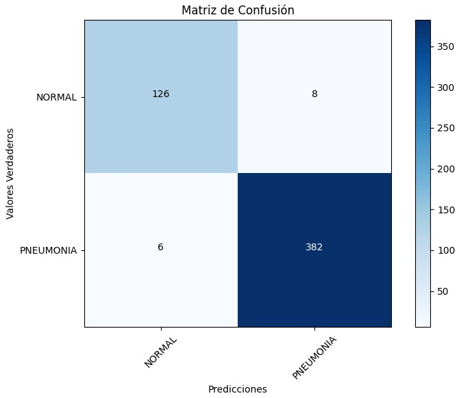
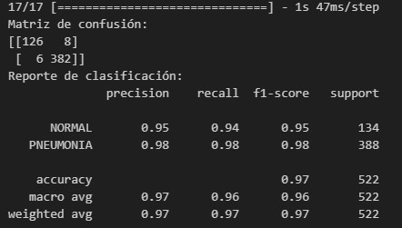
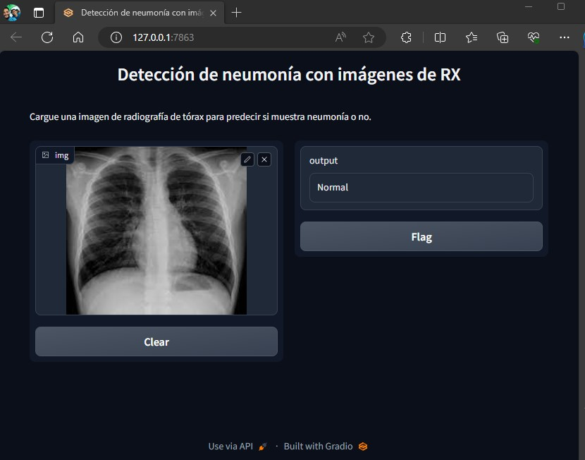

# Mi Proyecto_UCAMP

Proyecto de Detección de Neumonía en Imágenes de Rayos X de Pecho con CNN
*Autor: Sandra Vázquez*

##Introducción

Este proyecto representa el resultado de aplicar con éxito los conocimientos adquiridos a lo largo del Bootcamp de Ciencia de Datos e Inteligencia Artificial. Se enfoca en consolidar las técnicas de limpieza, entrenamiento, graficación y ajuste de modelos de Machine Learning en el contexto de la detección de neumonía en imágenes de rayos X de pecho.

### Dataset
El dataset utilizado en este proyecto proviene de Kaggle y se titula "Imágenes de rayos X de pecho para detectar neumonía" donde lo podrás encontrar en  https://www.kaggle.com/datasets/paultimothymooney/chest-xray-pneumonia.  
Este dataset presenta un desafío interesante para la detección de neumonía a partir de imágenes médicas de rayos X.

Este proyecto es una contribución al campo de la salud y la inteligencia artificial, con el objetivo de mejorar la detección temprana de enfermedades respiratorias como la neumonía a través de análisis de imágenes médicas.

Para este proyecto se realizaron dos modelos:
"prueba 3"
"proyectoucamp"

Donde el segundo resultó con un mejor accuracy, a continuación se explica cada uno de ellos.

### Explicación "prueba3"

Durante el EDA se observó una marcada discrepancia en el tamaño de las clases entre las imágenes etiquetadas como "NORMAL" y "PNEUMONIA". En particular, se identificó que la clase "NORMAL" tenía un número significativamente menor de muestras en comparación con la clase "PNEUMONIA". Esta disparidad planteó una pregunta fundamental sobre si la distribución desigual de las clases podría influir en el rendimiento del modelo de Machine Learning.

Dado el desbalance en el tamaño de las clases, se procedió a entrenar un modelo de Machine Learning, específicamente una red neuronal convolucional (CNN), utilizando el conjunto de datos. El objetivo principal era evaluar si el modelo sería capaz de detectar eficazmente la neumonía en las imágenes de rayos X a pesar de la diferencia en la cantidad de muestras entre las clases.

Resultados
 
 Los resultados del modelo revelaron una clara disparidad en el rendimiento entre las clases "NORMAL" y "PNEUMONIA". A pesar de la alta precisión en la clase mayoritaria, el bajo recall en la clase minoritaria plantea preocupaciones sobre la capacidad del modelo para identificar correctamente los casos de "NORMAL". Este desafío podría atribuirse a la desigualdad en el tamaño de las clases en el conjunto de datos.

 ### Explicación "proyectoucamp"

 Este código se divide en dos partes principales: preprocesamiento de imágenes y una interfaz gráfica de usuario (GUI) para la predicción de neumonía en radiografías de tórax.

Preprocesamiento de Imágenes: En esta sección se cargan imágenes y las redimensionan así como normalizarlas. Luego, se dividen en conjuntos de entrenamiento, validación y prueba. Las etiquetas se codifican en formato one-hot. Esto para que la preparación de datos y en la evaluación del rendimiento del modelo, garanticen que se entrene de manera efectiva, se ajuste adecuadamente y se evalúe de manera justa en datos que no ha visto previamente.

Función de Predicción: Se define una función pneumoniaPrediction que toma una imagen como entrada y utiliza un modelo previamente entrenado (model) para predecir si la imagen muestra neumonía o no.

Interfaz Gráfica de Usuario (GUI): Se utiliza Gradio para crear una interfaz gráfica simple que permite a los usuarios cargar una imagen de radiografía de tórax y obtener una predicción en tiempo real sobre si muestra neumonía o no.

Esta aplicación es útil para evaluar la capacidad de tu modelo de detección de neumonía en datos de entrada en tiempo real a través de una interfaz de usuario amigable.

Resultados:

La matriz de confusión revela que el modelo logró un alto rendimiento en la detección de la clase "NORMAL" y la clase "PNEUMONIA". En la clase "NORMAL", se observaron 126 predicciones correctas y solo 8 falsos positivos, lo que resultó en una alta precisión del 95%. Además, el modelo logró un alto recall del 94% en esta clase, lo que significa que identificó adecuadamente la mayoría de los casos "NORMAL".

En la clase "PNEUMONIA", el modelo alcanzó un rendimiento aún más impresionante, con 382 predicciones correctas y solo 6 falsos negativos. Esto condujo a una precisión del 98% y un recall del 98% en la detección de la "PNEUMONIA".

Reporte de Clasificación:
El informe de clasificación proporciona una visión general del rendimiento del modelo en ambas clases. Para la clase "NORMAL", el modelo obtuvo una puntuación F1 del 95%, lo que indica un equilibrio sólido entre precisión y recall. En la clase "PNEUMONIA", el modelo logró una puntuación F1 aún más alta del 98%, lo que indica una capacidad excepcional para detectar esta condición.

Además, se implementó una interfaz de usuario utilizando Gradio para permitir que los usuarios carguen imágenes de radiografía de tórax y obtengan predicciones instantáneas basadas en el modelo entrenado. Este enfoque interactivo facilita el acceso a la capacidad de detección de neumonía en imágenes médicas, incluso para personas sin experiencia en ciencia de datos e inteligencia artificial.

Estos resultados sólidos sientan las bases para la implementación exitosa de Gradio como interfaz para la detección de neumonía en imágenes médicas.
